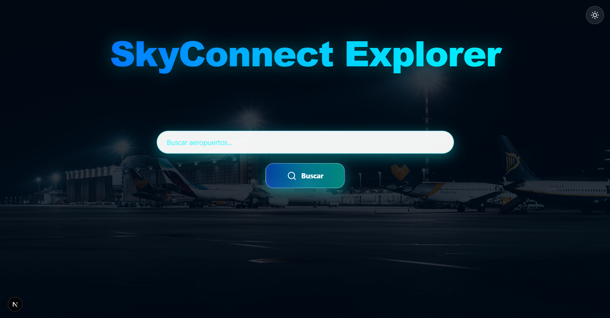
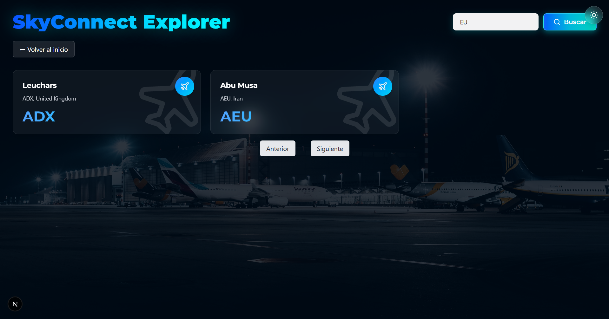

# 🛫 **SkyConnect Explorer**

Explorador de aeropuertos con información detallada y búsqueda en tiempo real.  
Construido con **Next.js 16**, **React 19**, **TypeScript** y **Tailwind CSS 4**.

---

## 📸 **Screenshots**

### Vista previa (malla 4 columnas)

<div style="display: grid; grid-template-columns: repeat(4, 1fr); gap: 12px;">
  
  
  
  
</div>

---

## ✨ **Características Principales**

- 🔍 **Búsqueda en tiempo real** (con debounce)
- 🗺️ **Mapas interactivos** con *Leaflet + React-Leaflet*
- 🌓 **Tema claro/oscuro** persistente *(localStorage)*
- 📱 **Responsive:** mobile, tablet y desktop
- 📊 Información detallada: **ubicación, IATA/ICAO, zona horaria**
- 📝 **Historial de búsqueda** (máx. 10)
- ⚡ **Zustand** para estado global
- 🧪 **Testing** con *Jest + React Testing Library*
- 🎨 **Fuente Montserrat personalizada**
- 🌐 **Integración con AviationStack API**

---

## 🚀 **Inicio Rápido**

### **Requisitos**

- Node.js **20.x** o superior  
- npm / yarn / pnpm / bun  
- API Key gratuita de **AviationStack**

---

### **1️⃣ Clonar el repositorio**

```bash
git clone https://github.com/tu-usuario/skyconnect-explorer.git
cd skyconnect-explorer
```

### **2️⃣ Instalar dependencias**
```bash
npm install
# o
yarn install
```
### **3️⃣ Configurar la API Key**

Ya hay una API-Key con el plan gratuito.
```bash
Edita:

app/services/aviationstack.service.ts


Reemplaza:

const API_KEY = "TU_API_KEY_AQUI";
```

El plan gratuito usa HTTP.
Si tienes plan de pago, habilita HTTPS en apiClient.ts.

### **4️⃣ Ejecutar en desarrollo**
```bash
npm run dev
```

Luego abre:
👉 http://localhost:3000

### **5️⃣ Build de producción**
```bash
npm run build
npm start
```

### **📂 Estructura del Proyecto**
```
skyconnect-explorer/
├── app/
│   ├── airport/[id]/
│   ├── components/
│   ├── services/
│   ├── stores/
│   ├── __tests__/
│   ├── globals.css
│   ├── layout.tsx
│   └── page.tsx
├── public/
│   ├── fonts/Montserrat/
│   ├── airport-bg.jpg
│   └── airport-bg-light.jpg
├── __mocks__/
├── jest.config.ts
├── jest.setup.ts
├── next.config.ts
├── tailwind.config.ts
├── tsconfig.json
└── package.json
```


### **🧪 Testing**
```bash
npm test            # correr tests
npm run test:watch  # modo watch
npm run test:coverage  # cobertura
npm run test:verbose   # output detallado
npm run test:clear     # limpiar cache
```
🌐 API de AviationStack
Endpoints usados:
// Listar aeropuertos
GET http://api.aviationstack.com/v1/airports
  ?access_key=YOUR_KEY
  &limit=100

// Detalles del aeropuerto
GET http://api.aviationstack.com/v1/airports
  ?access_key=YOUR_KEY
  &iata_code=JFK


Limitaciones del plan gratuito:

1000 requests/mes

Solo HTTP

Sin soporte para search=

El proyecto implementa búsqueda del lado del cliente

🤝 Contribuir

Haz un fork

Crea rama

git checkout -b feature/MiFeature


Commit

git commit -m "Añade MiFeature"


Push

git push origin feature/MiFeature


Abre un Pull Request